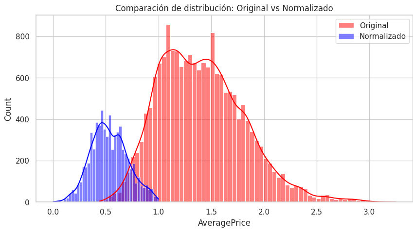

## Informe de limpieza y normalización del dataset de aguacate

### Objetivo

Preparar un conjunto de datos limpio y escalado para modelado de regresión, partiendo del archivo original `data/raw/avocado.csv`. Se busca:

- Eliminar inconsistencias (nulos y atípicos extremos) que puedan sesgar el ajuste.
- Transformar la fecha en variables útiles para capturar estacionalidad.
- Codificar variables categóricas para usarlas en algoritmos numéricos.
- Escalar variables numéricas a un rango comparable para estabilizar y acelerar el entrenamiento (especialmente en redes neuronales y modelos basados en distancia).

Fuente de verdad: el procesamiento se documenta en el notebook `notebooks/limpieza_normalización.ipynb`. El resultado final se guarda en `data/processed/avocado_cleaned_normalized.csv`.

---

## Paso a paso del proceso

### 1) Carga y librerías

Se importan `pandas`, `numpy`, `matplotlib`, `seaborn` y `MinMaxScaler` de `scikit-learn`. Se carga el CSV original desde `../data/raw/avocado.csv`.

Justificación: Pandas facilita la manipulación tabular; MinMaxScaler permite escalar de forma consistente y reproducible.

### 2) Revisión de valores nulos

- Se contabilizan nulos por columna (`data.isnull().sum()`).
- Se visualizan con un mapa de calor (`sns.heatmap(data.isnull(), ...)`).

Justificación: Los valores faltantes pueden romper el entrenamiento de muchos modelos o distorsionar estadísticas. Antes de imputar/eliminar, se verifica su magnitud y patrón. En este caso, el dataset no presenta un problema significativo de nulos.

### 3) Ingeniería de la fecha

- Se convierte `Date` a tipo `datetime`.
- Se extraen: `year`, `month`, `day`, `day_of_week`.
- Se elimina la columna original `Date` (para evitar redundancia y facilitar modelos lineales).

Justificación: Muchos fenómenos de precio tienen estacionalidad y tendencias por año/mes/día. Las variables derivadas capturan esa estructura de forma explícita.

### 4) Detección y eliminación de outliers (IQR)

Para cada columna numérica, se filtran observaciones fuera de los límites basados en el rango intercuartílico (IQR):

$$\mathrm{IQR} = Q_3 - Q_1$$

Límites:

$$\text{lower} = Q_1 - 1.5\,\mathrm{IQR}, \quad \text{upper} = Q_3 + 1.5\,\mathrm{IQR}$$

Se conservan filas con valores entre `lower` y `upper` para cada variable numérica (aplicado de manera iterativa).

Justificación: El método IQR es robusto y sencillo. Los atípicos extremos pueden dominar la escala y afectar severamente modelos sensibles a rangos (p. ej., redes neuronales). El filtrado reduce ese impacto.

Consideraciones:

- El filtrado iterativo por múltiples columnas puede reducir el dataset más de lo deseado; conviene monitorear la cantidad de filas resultantes y, de ser necesario, optar por recortes por variable, winsorización o reglas por grupo (p. ej., por región o tipo).
- Si se realiza partición train/test, es preferible detectar y tratar outliers usando únicamente el conjunto de entrenamiento para evitar fuga de información.

### 5) Codificación de variables categóricas (dummies)

Se identifican columnas categóricas y se aplican variables indicadoras con `pd.get_dummies(..., drop_first=True)`.

Justificación:

- Los algoritmos numéricos requieren entradas numéricas.
- `drop_first=True` evita la trampa de variables ficticias (perfecta colinealidad) en modelos lineales.

### 6) Normalización de variables numéricas (Min-Max)

Se aplica `MinMaxScaler` a todas las columnas numéricas del dataset de trabajo, escalando cada variable al rango [0, 1]:

$$x' = \frac{x - x_{\min}}{x_{\max} - x_{\min}}$$

Justificación:

- Asegura que todas las variables contribuyan con magnitudes comparables.
- Mejora la estabilidad numérica y la convergencia de modelos como redes neuronales.

Consideraciones:

- En flujos de modelado supervisado, el escalado debe ajustarse únicamente con el conjunto de entrenamiento y luego aplicarse al de validación/prueba (para evitar fuga de información). Guarde el scaler para inferencia.
- Si el objetivo (`AveragePrice`) se usa como variable de salida, no es obligatorio escalarla para modelos lineales/árboles. En redes neuronales puede ser útil escalarla; en ese caso, recuerde desescalar predicciones al reportar métricas en la unidad original.

### 7) Exportación del dataset procesado

Se guarda el resultado en `data/processed/avocado_cleaned_normalized.csv`.

Justificación: Separar datos `raw` y `processed` garantiza reproducibilidad y evita alterar el origen de datos.

### 8) Verificación visual

Se comparan las distribuciones de `AveragePrice` original vs. normalizada con histogramas superpuestos.

Interpretación: La normalización Min-Max preserva la forma relativa (transformación lineal); el objetivo es ajustar la escala, no cambiar la distribución.

---

## Decisiones clave y por qué

- IQR para outliers: método robusto, no paramétrico y fácil de interpretar.
- Dummies con `drop_first`: previene colinealidad perfecta, estableciendo un baseline.
- Min-Max en lugar de estandarización (Z-score): para redes neuronales es habitual usar rangos acotados en [0, 1]. Si un modelo asumiera normalidad de las variables, considerar Z-score.
- Ingeniería de fecha: aporta señales estacionales sin aumentar complejidad excesiva.

---

## Artefactos generados

- Dataset procesado: `data/processed/avocado_cleaned_normalized.csv`
- Notebook fuente: `notebooks/limpieza_normalización.ipynb`

---

## Reproducibilidad

1. Abra y ejecute el notebook `notebooks/limpieza_normalización.ipynb` usando el entorno indicado en `requirements.txt`.
2. Verifique que existe el archivo de entrada `data/raw/avocado.csv`.
3. Al finalizar, confirme que se generó `data/processed/avocado_cleaned_normalized.csv`.

Sugerencias para producción:

- Separar explícitamente partición train/val/test y ajustar el `MinMaxScaler` solo con train.
- Persistir transformadores (p. ej., con `joblib`) para reuso en inferencia.
- Registrar métricas de filas removidas por outliers y el impacto por columna.

---

## Riesgos y mejoras futuras

- Filtrado agresivo de outliers: evaluar winsorización o límites por grupo (región/tipo) si se pierden demasiadas filas.
- Escalado del objetivo: decidir según el modelo; si se escala, documentar el proceso de desescalado de predicciones.
- Pipeline reproducible: migrar el flujo a una `Pipeline` de `scikit-learn` con pasos de codificación y escalado, y validación cruzada.

---

## Referencias breves

- Tukey (1977): Exploratory Data Analysis (IQR y boxplots).
- Scikit-learn: `MinMaxScaler` y `Pipeline`.

---

### Resumen ejecutivo

Se partió del dataset crudo, se verificaron nulos, se enriqueció la fecha con componentes anuales/mensuales/semana, se mitigaron outliers mediante IQR, se convirtieron categorías a dummies y se normalizaron variables numéricas con Min-Max. El resultado es un CSV listo para modelado, con mejor estabilidad numérica y menor sensibilidad a valores extremos.

