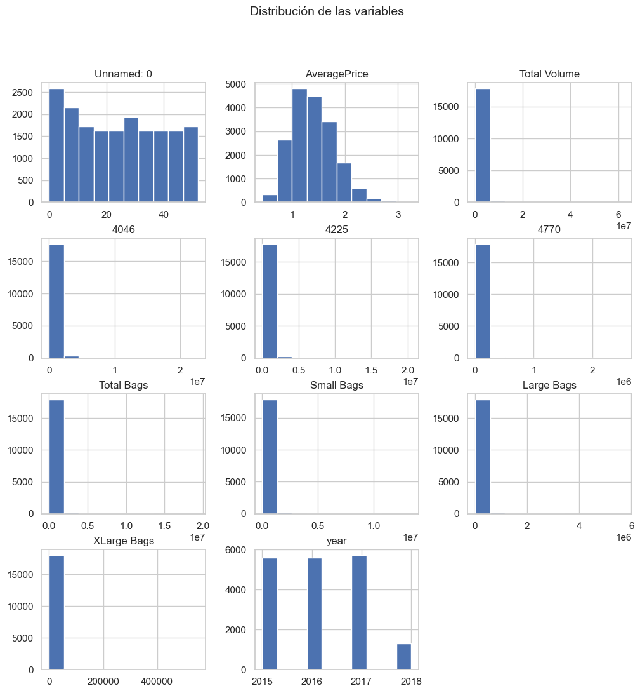
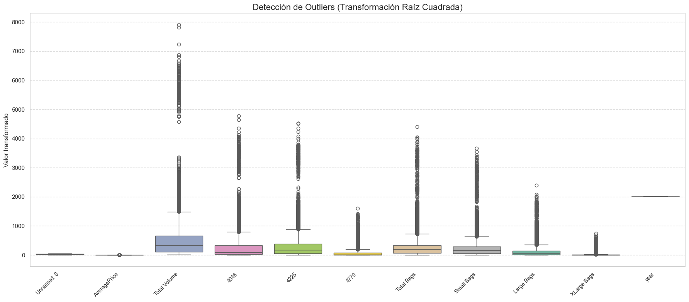
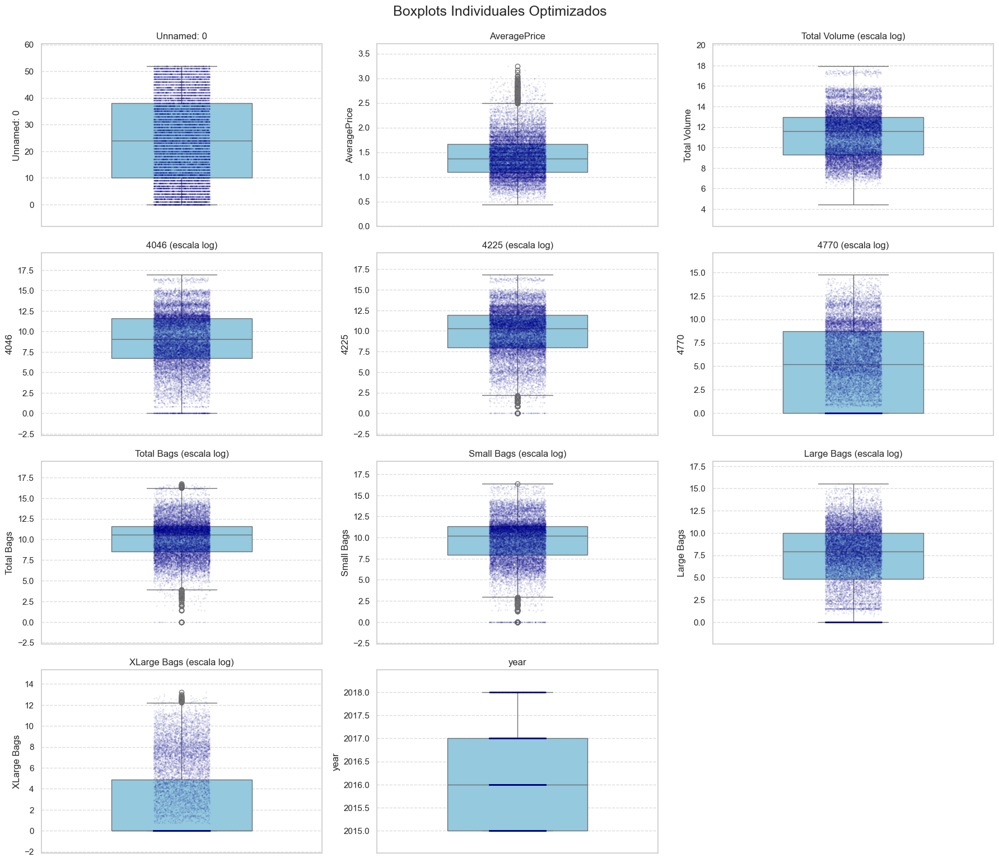
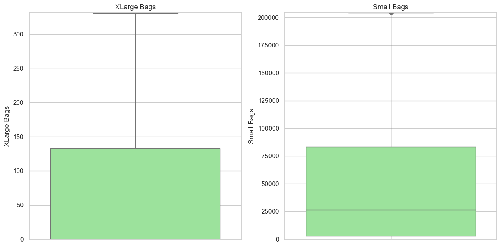
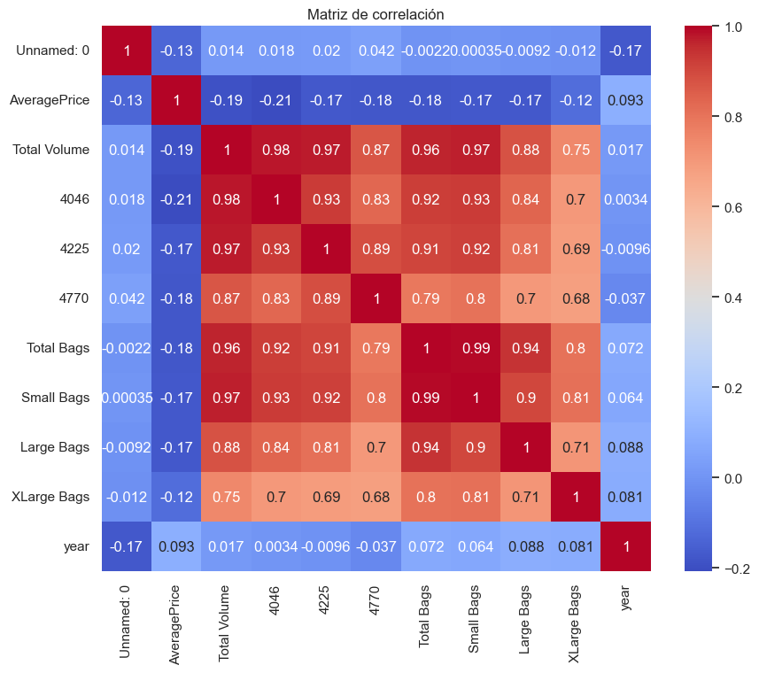
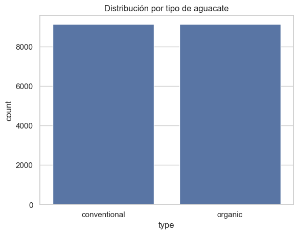
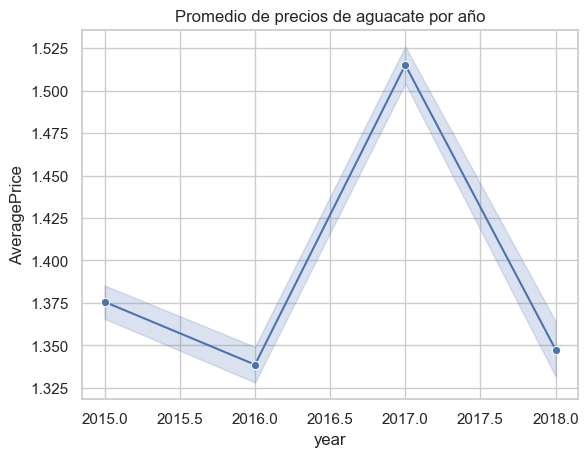

# Análisis Exploratorio de Datos: Dataset de Aguacates

## 1. Visión General del Dataset

El dataset contiene información sobre precios y volúmenes de venta de aguacates en diferentes regiones de Estados Unidos. Con dimensiones de 18.249 filas y 14 columnas, cubre datos recolectados durante varios años.

```
Dimensiones del dataset: (18249, 14)
```

Las principales variables incluyen:
- `AveragePrice`: Precio promedio del aguacate
- Variables de volumen: `Total Volume`, `4046`, `4225`, `4770`
- Tipos de empaque: `Total Bags`, `Small Bags`, `Large Bags`, `XLarge Bags`
- Variables categóricas: `type`, `year`, `region`

## 2. Distribución de Variables



### 2.1 Precio Promedio (AveragePrice)

El precio promedio de los aguacates muestra una distribución relativamente normal, con algunos valores atípicos:
- **Media**: $1.37
- **Rango**: $0.44 - $3.25
- **Distribución**: Ligeramente sesgada a la derecha

> **Insight**: La mayoría de los aguacates se venden en un rango de precio entre $1.00 y $1.75, con algunos mercados premium alcanzando precios superiores a $2.50.

### 2.2 Variables de Volumen

Todas las variables relacionadas con volumen muestran distribuciones fuertemente sesgadas a la derecha, con numerosos valores atípicos:

- **Total Volume**: La mayoría de las transacciones son de volumen pequeño a medio, con algunos picos ocasionales muy altos
- **Códigos PLU (4046, 4225, 4770)**: Representan diferentes calibres de aguacates, siendo 4046 (pequeño) y 4225 (grande) los más vendidos

> **Insight**: Existe una gran variabilidad en los volúmenes de venta, con algunos mercados/regiones dominando significativamente el comercio de aguacates.

### 2.3 Bolsas (Bags)

- **Small Bags**: Representan la mayoría del volumen de bolsas vendidas
- **Large Bags** y **XLarge Bags**: Menor popularidad, con distribuciones altamente sesgadas

> **Insight**: Los consumidores prefieren mayoritariamente aguacates en bolsas pequeñas, posiblemente para consumo familiar de corto plazo.

## 3. Detección de Outliers

El análisis de boxplots reveló:



- Variables de volumen contienen numerosos outliers extremos que distorsionan las visualizaciones
- Las transformaciones logarítmicas y de raíz cuadrada mejoraron la visualización, revelando que:
  - `Total Volume` tiene outliers que llegan hasta 6 veces el rango intercuartílico
  - `Small Bags` y `XLarge Bags` presentan la mayor proporción de outliers





> **Insight**: Existen periodos o regiones con ventas excepcionalmente altas que representan eventos especiales o temporadas pico.

## 4. Correlaciones entre Variables

Del mapa de calor de correlación se observó:



- **Alta correlación positiva** (>0.8) entre `Total Volume` y variables de conteo específicas (4046, 4225)
- **Correlación moderada a alta** (0.6-0.9) entre `Total Bags` y tipos específicos de bolsas
- **Baja correlación** entre `AveragePrice` y variables de volumen, generalmente negativa (-0.2 a -0.4)

> **Insight**: El precio promedio tiende a disminuir cuando aumenta el volumen de ventas, sugiriendo efectos de economía de escala o estacionalidad en la oferta/demanda.

## 5. Análisis por Tipo de Aguacate

La distribución por tipo muestra:



- **Convencional**: Aproximadamente 2/3 de los registros
- **Orgánico**: Aproximadamente 1/3 de los registros

> **Insight**: Los aguacates convencionales dominan el mercado, aunque existe una presencia significativa de aguacates orgánicos.

## 6. Tendencia de Precios por Año

El análisis temporal muestra:



- Ligero aumento en precios promedio entre 2015 y 2018
- Fluctuaciones estacionales en los precios (no visibles directamente en el gráfico anual; para visualizar estos patrones sería necesario un análisis de series temporales con mayor granularidad, como mensual o trimestral)

> **Insight**: Existe una tendencia alcista en los precios de los aguacates a lo largo de los años, lo que podría reflejar mayor demanda o efectos inflacionarios.

## 7. Conclusiones Principales

1. **Variabilidad de mercado**: Existe gran heterogeneidad en volúmenes y precios entre diferentes regiones
2. **Preferencias de empaque**: Las bolsas pequeñas son claramente preferidas por los consumidores
3. **Estacionalidad**: Los outliers en volumen sugieren periodos de alta demanda (posiblemente eventos como Super Bowl)
4. **Relación precio-volumen**: Correlación negativa entre precio y volumen sugiere efectos de oferta y demanda
5. **Crecimiento del mercado**: Tendencia al alza en precios indica creciente popularidad del aguacate
6. **Segmentación de mercado**: Coexistencia significativa de aguacates convencionales y orgánicos

> **Insight final**: El mercado de aguacates muestra patrones complejos de precio y volumen que varían por región, tipo y empaque, con una clara tendencia alcista en precios y preferencia por empaques pequeños. La presencia significativa del segmento orgánico sugiere un mercado en evolución hacia productos premium.