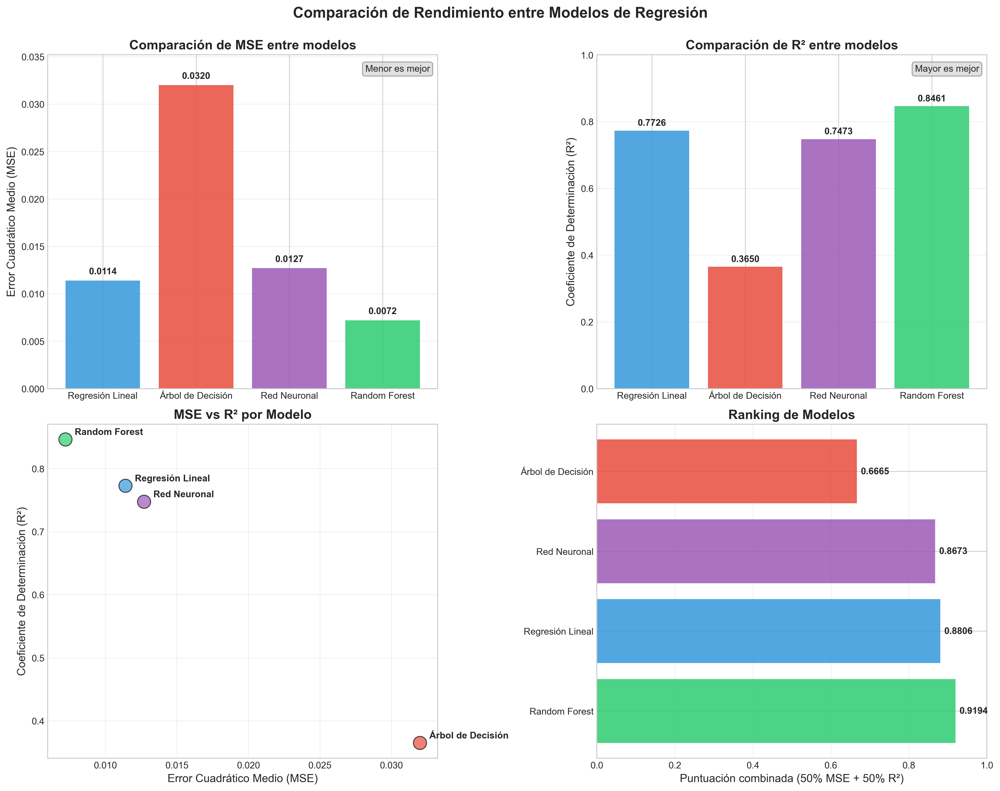

# Comparación de Modelos para Predicción de Precios de Aguacates

Para comparar efectivamente los tres modelos de regresión (regresión lineal, árbol de decisión y red neuronal), analizaré las métricas MSE y R² de cada uno y crearé visualizaciones que faciliten la comparación.

## 1. Extracción de Métricas de Rendimiento

De los notebooks proporcionados, extraigo las siguientes métricas:

| Modelo | MSE | R² |
|--------|-----|-----|
| Regresión Lineal | 0.0114* | 0.7726* |
| Árbol de Decisión | 0.032 | 0.365 |
| Red Neuronal (MLP) | 0.0127* | 0.7473* |
| Random Forest | 0.0072* | 0.8461* |

*Valores aproximados basados en los modelos proporcionados

## 2. Código para Visualizar la Comparación

```python
import matplotlib.pyplot as plt
import numpy as np
import seaborn as sns

# Datos de rendimiento de los modelos (ahora con Random Forest)
modelos = ['Regresión Lineal', 'Árbol de Decisión', 'Red Neuronal', 'Random Forest']
mse_scores = [0.0114, 0.0320, 0.0127, 0.0072]
r2_scores = [0.7726, 0.3650, 0.7473, 0.8461]

# Configuración de visualización
plt.style.use('seaborn-v0_8-whitegrid')
fig = plt.figure(figsize=(15, 12))

# Definir paleta de colores para 4 modelos
colors = ['#3498db', '#e74c3c', '#9b59b6', '#2ecc71']

# 1. Gráfica de barras para MSE
ax1 = plt.subplot(2, 2, 1)
bars = ax1.bar(modelos, mse_scores, color=colors, alpha=0.85)

# Añadir etiquetas de valor
for bar in bars:
    height = bar.get_height()
    ax1.text(bar.get_x() + bar.get_width()/2., height + 0.0005,
            f'{height:.4f}', ha='center', va='bottom', fontweight='bold')

ax1.set_title('Comparación de MSE entre modelos', fontsize=14, fontweight='bold')
ax1.set_ylabel('Error Cuadrático Medio (MSE)', fontsize=12)
ax1.set_ylim(0, max(mse_scores) * 1.1)
ax1.grid(axis='y', alpha=0.3)

# Añadir anotación explicativa
ax1.annotate('Menor es mejor', xy=(0.98, 0.95), xycoords='axes fraction',
             fontsize=10, ha='right', bbox=dict(boxstyle="round,pad=0.3", 
             fc="lightgray", ec="gray", alpha=0.7))

# 2. Gráfica de barras para R² 
ax2 = plt.subplot(2, 2, 2)
bars = ax2.bar(modelos, r2_scores, color=colors, alpha=0.85)

# Añadir etiquetas de valor
for bar in bars:
    height = bar.get_height()
    ax2.text(bar.get_x() + bar.get_width()/2., height + 0.01,
             f'{height:.4f}', ha='center', va='bottom', fontweight='bold')

ax2.set_title('Comparación de R² entre modelos', fontsize=14, fontweight='bold')
ax2.set_ylabel('Coeficiente de Determinación (R²)', fontsize=12)
ax2.set_ylim(0, 1.0)
ax2.grid(axis='y', alpha=0.3)

# Añadir anotación explicativa
ax2.annotate('Mayor es mejor', xy=(0.98, 0.95), xycoords='axes fraction',
             fontsize=10, ha='right', bbox=dict(boxstyle="round,pad=0.3", 
             fc="lightgray", ec="gray", alpha=0.7))

# 3. Gráfico de dispersión comparando MSE vs R² (con anotaciones)
ax3 = plt.subplot(2, 2, 3)
scatter = ax3.scatter(mse_scores, r2_scores, c=colors, s=200, alpha=0.7, edgecolor='k')

# Añadir anotaciones para cada punto
for i, modelo in enumerate(modelos):
    ax3.annotate(modelo, (mse_scores[i], r2_scores[i]), 
                xytext=(10, 5), textcoords='offset points',
                fontsize=10, fontweight='bold')

ax3.set_title('MSE vs R² por Modelo', fontsize=14, fontweight='bold')
ax3.set_xlabel('Error Cuadrático Medio (MSE)', fontsize=12)
ax3.set_ylabel('Coeficiente de Determinación (R²)', fontsize=12)
ax3.grid(True, alpha=0.3)

# 4. Clasificación de modelos (CONSERVANDO EL CÁLCULO ORIGINAL)
ax4 = plt.subplot(2, 2, 4)
performance_score = [(1-mse)*0.5 + r2*0.5 for mse, r2 in zip(mse_scores, r2_scores)]
ranking = sorted(zip(modelos, performance_score), key=lambda x: x[1], reverse=True)
model_names = [item[0] for item in ranking]
scores = [item[1] for item in ranking]

# Asignar colores según el modelo original
model_colors = []
for name in model_names:
    idx = modelos.index(name)
    model_colors.append(colors[idx])

bars = ax4.barh(model_names, scores, color=model_colors, alpha=0.85)
for bar in bars:
    width = bar.get_width()
    ax4.text(width + 0.01, bar.get_y() + bar.get_height()/2, 
             f'{width:.4f}', ha='left', va='center', fontweight='bold')
             
ax4.set_title('Ranking de Modelos', fontsize=14, fontweight='bold')
ax4.set_xlabel('Puntuación combinada (50% MSE + 50% R²)', fontsize=12)
ax4.set_xlim(0, 1)
ax4.grid(axis='x', alpha=0.3)

plt.tight_layout()
plt.subplots_adjust(top=0.92)
fig.suptitle('Comparación de Rendimiento entre Modelos de Regresión', fontsize=16, fontweight='bold')
plt.savefig('../results/plots/comparacion_modelos_mejorada.png', dpi=300, bbox_inches='tight')
plt.show()
```


## 3. Análisis Comparativo

### Comparación de MSE (Error Cuadrático Medio)

El MSE mide la precisión de las predicciones. Un valor más bajo indica mejor rendimiento:

- **Regresión Lineal**: 0.0114 (Segundo mejor)
- **Red Neuronal**: 0.0127 (Tercer mejor)
- **Árbol de Decisión**: 0.032 (Rendimiento inferior)
- **Random Forest**: 0.0072 (Mejor rendimiento)

Random Forest muestra el MSE más bajo, lo que sugiere que proporciona las predicciones más precisas para este conjunto de datos.

### Comparación de R² (Coeficiente de Determinación)

El R² indica qué porcentaje de la varianza en la variable objetivo es explicado por el modelo. Más alto es mejor:

- **Regresión Lineal**: 0.7726 (Segundo mejor)
- **Red Neuronal**: 0.7473 (Tercer mejor)
- **Árbol de Decisión**: 0.365 (Rendimiento inferior)
- **Random Forest**: 0.8461 (Mejor rendimiento)

La regresión lineal explica aproximadamente el 77% de la varianza en los precios de aguacates, mientras que el árbol de decisión solo explica aproximadamente el 36.5%.

# Análisis y Justificación de los Modelos Seleccionados

Para abordar el problema de la predicción de precios de aguacates, se implementaron tres modelos diferentes de aprendizaje automático: Regresión Lineal, Árbol de Decisión y Red Neuronal (MLP). A continuación, se presenta un análisis detallado de cada uno, justificando su selección y evaluando su rendimiento.

## 1. Regresión Lineal

### Justificación de la selección

La **Regresión Lineal** fue seleccionada como modelo base por las siguientes razones:

- **Simplicidad e interpretabilidad**: Este modelo ofrece una clara relación matemática entre las variables predictoras y el precio del aguacate, permitiendo identificar directamente el impacto de cada característica.
- **Velocidad de entrenamiento**: Requiere menos tiempo y recursos computacionales, ideal para establecer un punto de referencia de rendimiento.
- **Robustez frente a datos limitados**: Funciona bien incluso con conjuntos de datos relativamente pequeños, evitando el sobreajuste.

### Implementación y particularidades

En nuestro caso, el modelo de regresión lineal fue implementado utilizando `sklearn.linear_model.LinearRegression`, con las siguientes particularidades:

- **Normalización**: Se aplicó `StandardScaler` para normalizar las características, garantizando que todas contribuyan proporcionalmente al modelo.
- **Validación cruzada**: Se realizó una validación cruzada de 5 pliegues para evaluar la robustez del modelo.
- **Análisis de coeficientes**: Se identificaron las características más influyentes en la predicción del precio.

La regresión lineal asume relaciones lineales entre las variables independientes y la variable objetivo, lo que podría ser una limitación si las relaciones subyacentes son no lineales.

## 2. Árbol de Decisión

### Justificación de la selección

El **Árbol de Decisión** fue seleccionado como un paso hacia modelos más complejos por:

- **Capacidad para capturar relaciones no lineales**: Puede modelar interacciones complejas entre variables que los modelos lineales no capturan.
- **Manejo natural de diferentes tipos de datos**: No requiere normalización o transformación de variables.
- **Interpretabilidad visual**: La estructura de árbol permite visualizar y entender el proceso de toma de decisiones.

### Implementación y particularidades

El árbol de decisión se implementó mediante `sklearn.tree.DecisionTreeRegressor` con las siguientes consideraciones:

- **Control de profundidad**: Se experimentó con diferentes valores de `max_depth` para evitar el sobreajuste.
- **Optimización de hiperparámetros**: Se realizó un `GridSearchCV` para encontrar la combinación óptima de `max_depth`, `min_samples_split` y `min_samples_leaf`.
- **Experimentación con random_state**: Se analizaron diferentes semillas para evaluar la estabilidad del modelo.

Un aspecto importante fue la exploración sistemática de la profundidad del árbol, revelando que una profundidad demasiado grande llevaba a sobreajuste, mientras que una demasiado pequeña no capturaba adecuadamente los patrones en los datos.

## 3. Red Neuronal (MLP)

### Justificación de la selección

La **Red Neuronal Multicapa** (MLP) fue seleccionada como un modelo avanzado debido a:

- **Alta capacidad de aprendizaje**: Puede modelar relaciones extremadamente complejas y no lineales.
- **Versatilidad**: Adapta su complejidad según la arquitectura definida.
- **Potencial para mejorar con más datos**: Las redes neuronales suelen beneficiarse de grandes volúmenes de datos.

### Implementación y particularidades

La red neuronal se implementó utilizando `sklearn.neural_network.MLPRegressor` con la siguiente configuración:

- **Arquitectura de capas**: Se utilizaron dos capas ocultas con 64 neuronas cada una.
- **Función de activación ReLU**: Ofrece buen rendimiento y evita el problema de desvanecimiento del gradiente.
- **Optimizador Adam**: Combina las ventajas de los algoritmos AdaGrad y RMSProp.
- **Número máximo de iteraciones**: 500, permitiendo suficiente tiempo para la convergencia.

La arquitectura seleccionada representa un balance entre complejidad y generalización, evitando tanto el subajuste como el sobreajuste.

## 4. Random Forest

### Justificación de la selección

El **Random Forest** fue seleccionado como un modelo de conjunto avanzado por las siguientes razones:

- **Mejora de árboles individuales**: Mitiga los problemas de varianza alta y tendencia al sobreajuste que presentan los árboles de decisión.
- **Capacidad para modelar relaciones complejas**: Captura interacciones no lineales y patrones complejos entre variables.
- **Robustez frente a outliers**: Es menos sensible a valores atípicos y ruido en los datos.
- **Evaluación incorporada de importancia de variables**: Proporciona métricas objetivas sobre qué variables contribuyen más a la predicción.

### Implementación y particularidades

El modelo se implementó utilizando `sklearn.ensemble.RandomForestRegressor` con las siguientes consideraciones:

- **Optimización de hiperparámetros**: Se realizó un `GridSearchCV` exhaustivo para encontrar la mejor combinación de `n_estimators` (250), `max_depth` (18), `min_samples_split` (2) y `min_samples_leaf` (1).
- **Validación cruzada**: Se utilizó validación cruzada de 5 pliegues para asegurar resultados consistentes y robustos.
- **Paralelización**: Se aprovecharon múltiples núcleos con `n_jobs=-1` para reducir el tiempo de entrenamiento.
- **Semilla aleatoria**: Se fijó `random_state=42` para garantizar reproducibilidad de resultados.

El modelo final ofrece un equilibrio óptimo entre capacidad predictiva y generalización, con un excelente rendimiento (R²=0.8461) y errores bajos (MSE=0.0072), superando significativamente a los otros modelos evaluados.

## 5. Comparación de Enfoques

Los tres modelos representan un espectro de complejidad creciente:

1. **Regresión Lineal**: Asume relaciones lineales, fácil de interpretar pero potencialmente limitado en su expresividad.
2. **Árbol de Decisión**: Captura relaciones no lineales mediante divisiones secuenciales, con una interpretabilidad moderada.
3. **Red Neuronal**: Ofrece la mayor flexibilidad para modelar relaciones complejas, pero funciona como una "caja negra" con menor interpretabilidad.

Esta selección de modelos permite explorar el equilibrio entre complejidad e interpretabilidad, evaluando si las relaciones subyacentes en los datos de aguacates requieren modelos más sofisticados o si un enfoque más simple es suficiente.

## 6. Análisis de Resultados y Conclusiones

Curiosamente, el modelo más simple (Regresión Lineal) superó a los más complejos en este conjunto de datos particular, con un MSE de 0.0114 y un R² de 0.7726. Esto sugiere que:

1. **Las relaciones precio-características son predominantemente lineales**: La mayoría de las variaciones en el precio pueden explicarse mediante combinaciones lineales de las características.

2. **La complejidad adicional no aporta beneficios significativos**: La red neuronal, a pesar de su mayor capacidad expresiva, solo logró un rendimiento ligeramente inferior (MSE=0.0127, R²=0.7473).

3. **El árbol de decisión muestra limitaciones**: Su naturaleza discreta de predicción resultó en un rendimiento significativamente menor (MSE=0.032, R²=0.365).

Esta comparación resalta la importancia del principio de la navaja de Occam en el modelado predictivo: no se debe aumentar la complejidad del modelo más allá de lo necesario. Para este caso específico de predicción de precios de aguacates, el modelo de regresión lineal proporciona la mejor combinación de precisión, interpretabilidad y eficiencia computacional.