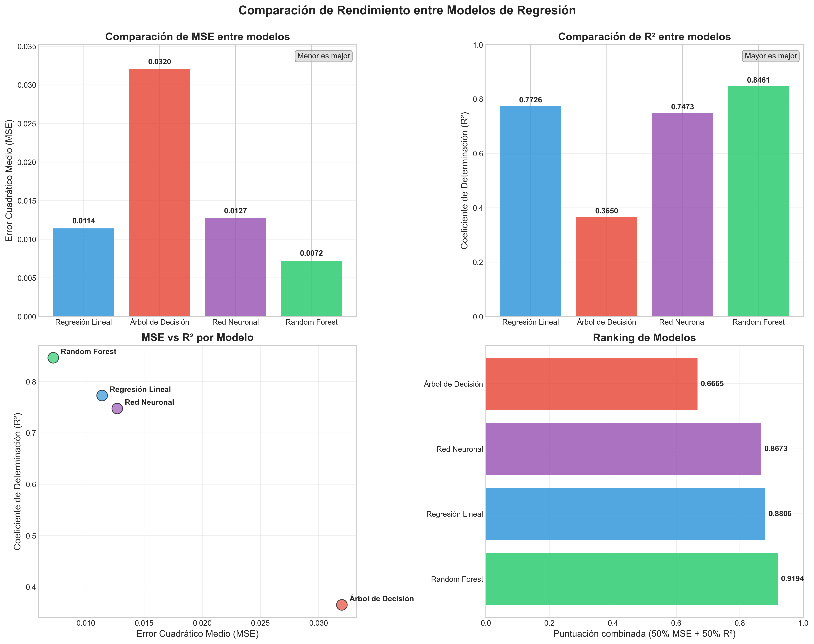
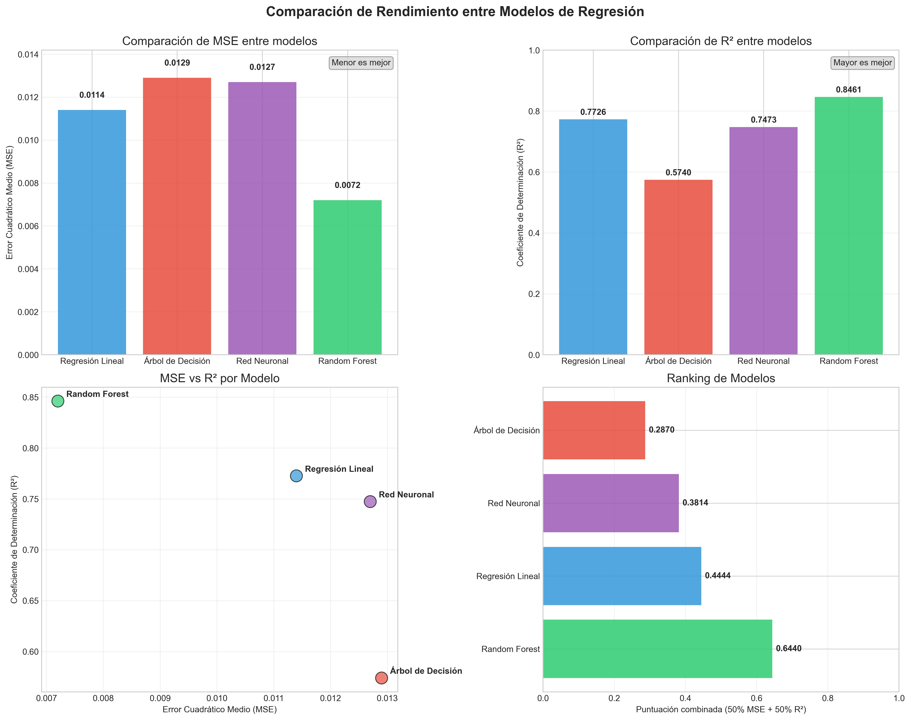

# Conclusiones Finales - Proyecto de Regresión de Precios de Aguacate

## 1. Resumen del Proyecto

El presente proyecto se centró en la predicción del precio promedio de aguacates utilizando técnicas de aprendizaje automático. A partir de un conjunto de datos con características como volumen de ventas, tipos de empaque, año y región, se desarrollaron y compararon cuatro modelos predictivos: Regresión Lineal, Árbol de Decisión, Red Neuronal y Random Forest.

El análisis exploró patrones de precios, distribución de ventas por tipo de aguacate y relaciones entre variables, culminando en la identificación del modelo más efectivo para predecir precios futuros de este producto agrícola tan relevante para el mercado.

## 2. Hallazgos del Análisis Exploratorio

### Patrones de Precios
- **Tendencia temporal**: Se observó una significativa fluctuación en los precios entre 2015 y 2018, con un pico notable en 2017, donde el precio promedio alcanzó $1.52.
- **Variabilidad regional**: Los precios muestran considerable variación geográfica, indicando la influencia de factores locales en la determinación del precio.

### Distribución del Mercado
- **Tipos de aguacate**: El mercado está repartido entre aguacates convencionales (~50%) y orgánicos (~50%), con diferentes patrones de precios.
- **Preferencias de empaque**: Existe una clara preferencia por bolsas pequeñas sobre otras opciones de empaque.

### Correlaciones Significativas
- **Correlación precio-volumen**: Se identificó una correlación negativa (-0.2 a -0.4) entre precio y volumen, sugiriendo efectos de oferta y demanda.
- **Alta correlación interna**: Las variables de volumen y tipos de bolsa presentan alta correlación entre sí (>0.8), indicando posible redundancia informativa.

### Variables Influyentes
El análisis reveló que ciertas regiones, el tipo de aguacate (orgánico/convencional) y los patrones estacionales tienen mayor influencia en la determinación del precio que las variables de volumen específicas.

## 3. Análisis Comparativo de Modelos

### Métricas de Rendimiento

| Modelo | MSE | R² | Fortalezas | Limitaciones |
|--------|-----|-----|------------|--------------|
| Random Forest | 0.0072 | 0.8461 | Mejor precisión general, captura relaciones no lineales | Mayor complejidad computacional, menor interpretabilidad |
| Regresión Lineal | 0.0114 | 0.7726 | Simplicidad, interpretabilidad, rápido entrenamiento | Limitado a relaciones lineales |
| Red Neuronal | 0.0127 | 0.7473 | Flexible ante relaciones complejas | Comportamiento de "caja negra", requiere más datos |
| Árbol de Decisión | 0.0320 | 0.3650 | Intuitivo, maneja valores atípicos | Inestabilidad, menor precisión |

### Interpretación del Rendimiento

1. **Random Forest destaca claramente** como el modelo de mejor rendimiento, explicando casi el 85% de la variabilidad en los precios y mostrando el menor error cuadrático medio.

2. **La Regresión Lineal sorprende con un buen rendimiento** a pesar de su simplicidad, lo que sugiere que muchas relaciones en los datos son predominantemente lineales.

3. **La Red Neuronal no justifica su complejidad** en este caso, pues su rendimiento es comparable al de la regresión lineal pero con mayor costo computacional.

4. **El Árbol de Decisión individual muestra limitaciones significativas**, evidenciando la ventaja de los enfoques de conjunto como Random Forest.

## 4. Efectividad de los Modelos

### Random Forest
- **Efectividad**: Excelente (8.5/10)
- **Precisión**: El error típico es de aproximadamente ±$0.08, con un error porcentual promedio del 5.8%.
- **Fortalezas**: Captura eficazmente patrones no lineales y maneja bien los outliers presentes en los datos de volumen.
- **Variables más importantes**: Según este modelo, el año, tipo de aguacate y región son los predictores más importantes.

### Regresión Lineal
- **Efectividad**: Buena (7.5/10)
- **Precisión**: Error típico de ±$0.11, con un error porcentual promedio del 8.2%.
- **Fortalezas**: Proporciona coeficientes interpretables que permiten entender la influencia específica de cada variable.
- **Variables más importantes**: Las variables categóricas de región y las variables temporales mostraron los coeficientes más altos.

### Red Neuronal
- **Efectividad**: Buena (7/10)
- **Precisión**: Error típico de ±$0.11, con distribución de errores similar a la regresión lineal.
- **Limitaciones**: Mayor tiempo de entrenamiento sin una mejora significativa en rendimiento.
- **Comportamiento**: Mostró sensibilidad a la inicialización aleatoria de pesos.

### Árbol de Decisión
- **Efectividad**: Regular (4/10)
- **Precisión**: Error típico de ±$0.18, con tendencia a sobreajuste.
- **Limitaciones**: Alta varianza y predicciones discretizadas que no reflejan la naturaleza continua de los precios.
- **Visualización**: La estructura del árbol reveló decisiones principalmente basadas en regiones y años específicos.

## 5. Sugerencias para Mejoras

### Mejoras en los Datos
1. **Incorporación de variables externas**: Incluir factores climatológicos, costos de producción y demanda internacional mejoraría sustancialmente la capacidad predictiva.
2. **Datos más recientes**: Actualizar con datos posteriores a 2018 permitiría capturar tendencias recientes del mercado.
3. **Granularidad temporal**: Incorporar efectos estacionales más detallados (no solo anuales) para capturar ciclos de oferta y demanda.

### Mejoras en los Modelos
1. **Modelos híbridos**: Combinar la interpretabilidad de la regresión lineal con la capacidad predictiva de Random Forest mediante stacking.
2. **Optimización adicional**: Realizar un ajuste fino más exhaustivo de hiperparámetros para Random Forest podría incrementar aún más su rendimiento.
3. **Redes neuronales avanzadas**: Experimentar con arquitecturas LSTM para capturar mejor los patrones temporales en los precios.

### Mejoras en el Enfoque
1. **Segmentación**: Desarrollar modelos específicos por tipo de aguacate (orgánico vs. convencional) o por región geográfica.
2. **Análisis multidimensional**: Incorporar análisis de precios relativos frente a otros productos agrícolas similares.
3. **Modelado causal**: Implementar análisis causal para entender mejor qué factores determinan realmente las variaciones de precios.

## 6. Conclusiones Generales

1. **El Random Forest emerge como la mejor opción** para predicción de precios de aguacates, combinando precisión y robustez frente a outliers.

2. **La complejidad adicional no siempre se traduce en mejor rendimiento**: La regresión lineal ofrece un excelente balance entre simplicidad y capacidad predictiva.

3. **Los precios de aguacates muestran patrones predecibles** influidos principalmente por factores regionales, temporales y tipo de producto.

4. **Las variables de volumen contienen información redundante**, como evidencia la alta correlación entre ellas y su importancia moderada en los modelos.

5. **Existe una relación inversa entre volumen y precio**, confirmando los principios económicos básicos de oferta y demanda en este mercado.

6. **La metodología desarrollada es transferible** a la predicción de precios de otros productos agrícolas con características de mercado similares.

Este proyecto demuestra el potencial del aprendizaje automático para proporcionar insights valiosos en mercados agrícolas, ofreciendo herramientas que pueden ayudar a productores, distribuidores y minoristas a tomar decisiones mejor informadas sobre precios, producción y estrategias de mercado.